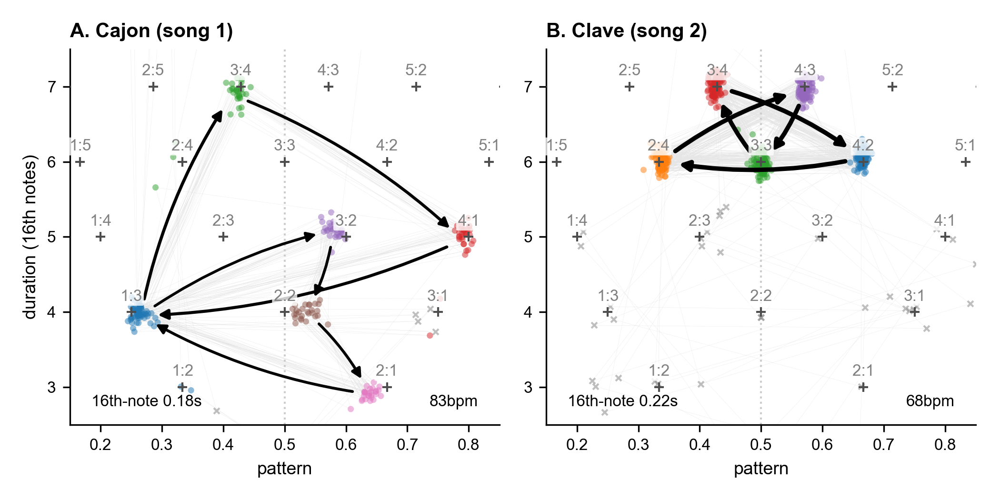

[](https://zenodo.org/badge/latestdoi/1097050911)

# Rhythmic Segment Analysis

**This repository contains the Python code, data, figures, and LaTeX sources for the paper _Rhythmic Segment Analysis_.**

📖 &nbsp;Paper (preprint coming soon) &nbsp;•&nbsp; 📜 [Supplementary materials](tex/supplements.pdf)

---




**Abstract.** This paper addresses how to conceptualize, visualize, and measure regularities in rhythmic data. I propose to think about rhythmic data in terms of interval segments: fixed-length groups of consecutive intervals, which can be decomposed into a duration and a pattern, the latter being a point in a rhythm simplex (e.g. 1 : 1 : 2). This simple conceptual framework unifies three rhythmic visualization methods and suggests a fourth: the pattern-duration plot. Paired with a cluster transition network, I show how it intuitively reveals regularities in both synthetic and real-world rhythmic data. Moreover, the framework generalizes two common measures of rhythmic structure: rhythm ratios and the normalized pairwise variability index (nPVI). In particular, nPVI can be reconstructed as the average distance from isochrony, and I propose a more general measure of anisochrony to replace it.


## [rhythmic-segments](https://bacor.github.io/rhythmic-segments/)

This repository makes extensive use of a small Python package `rhythmic-segments`. If you want to do a rhythmic segment analysis yourself, the [documentation](https://bacor.github.io/rhythmic-segments/) of that package may be a good place to start. The source files and notebooks in this repository may serve as a guide for more elaborate plots.

## Repository structure

- **`src/`** Python code for analysis and plotting utilities.
- **`data/`** Some generated data stored here (please download IEMP-CSS yourself; see notebook).
- **`figures/`** Generated figures (PNG/PDF); LaTeX sources reference these.
- **`scores/`** Musical score PDFs used in figures.
- **`notebooks/`** Jupyter notebooks that generate the figures, etc.
- **`tex/`** LaTeX sources for the supplementary materials and figures. `tex/.latexmkrc` controls build output. Note this directory also contains a small package `tex/rsa` for drawing segment projections (figures 2 and 3 in the paper).

## Installation 

This paper uses Python 3.11 (see `requires-python` in `pyproject.toml`) and uses Poetry to manage dependencies (`pipx install poetry` or `pip install --user poetry`). 


```bash
poetry env use python3.11
poetry install
poetry shell # activate (or prefix commands with 'poetry run')
```

## Citation

If you use the code in this repository in academic work, please cite the paper (forthcoming):

Cornelissen (forthcoming). Rhythmic Segment Analysis. **Link to preprint will be added soon.**

## License

All code (all Python/notebooks/LaTeX sources) is released under an MIT license (see `LICENSE`). All figures (PDF/PNG outputs in `figures/` and subfolders) are released under a CC BY 4.0 license (see `LICENSE.figures`).
